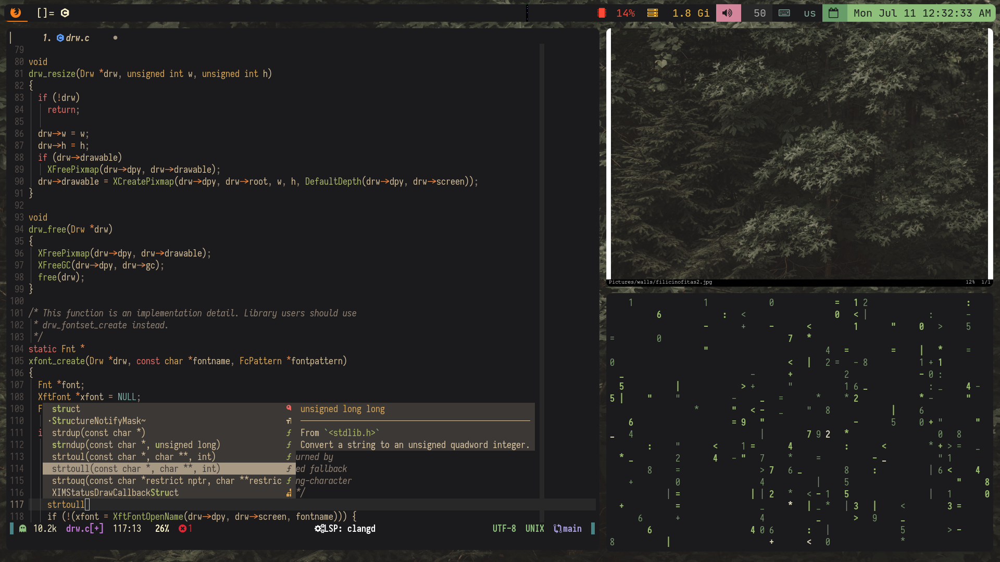
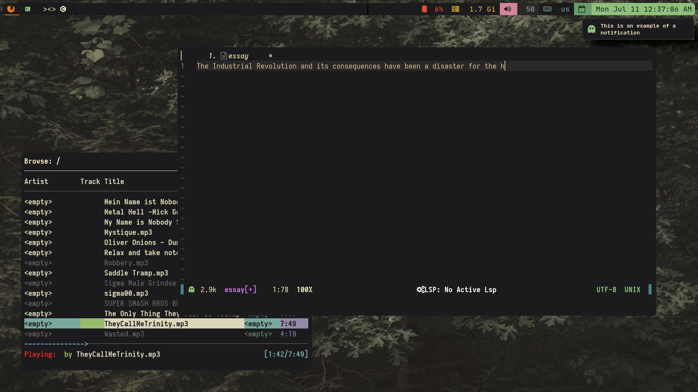
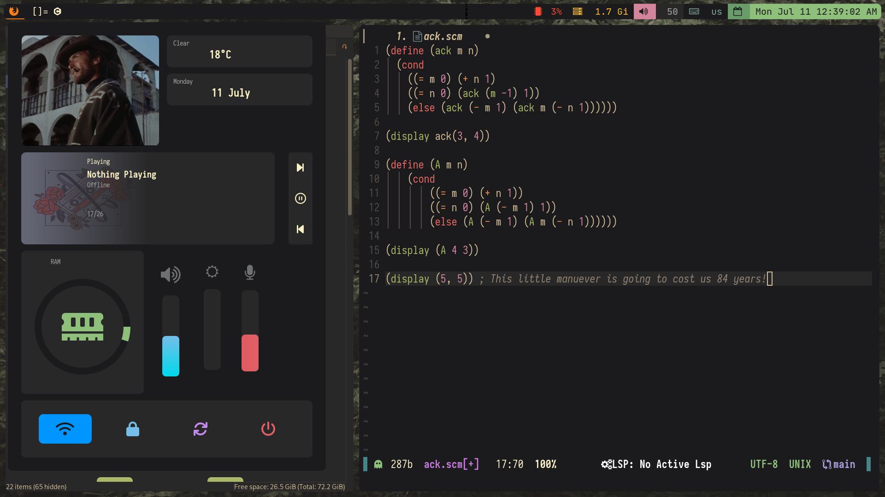
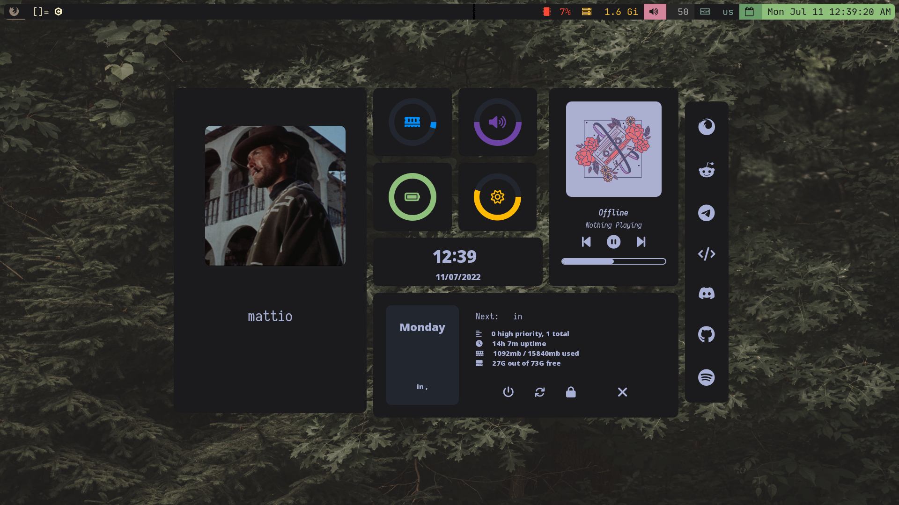

# This is a WIP

The main focus of this dotfiles is X11, but I also added my hyprland and waybar configs.

Keep in mind that hyprland is configured for my two monitor set-up, so you might need to change that.

### Configs
- Currently has configs of:

- [ ] nvim, check out [this](https://github.com/Mattio-cmd/SigmaNvim) amazing repository
- [x] dwm
- [x] st
- [x] slstatus
- [x] dmenu
- [x] slock
- [ ] hyprland
- [ ] alacritty
- [x] starship
- [x] zsh
- [x] hosts file
- [x] some fetch tools and their configs
- [x] picom (jonasburg for)
- [x] dunst
- [x] some X related stuff (xinitrc and Xressources)
- [x] kitty
- [x] eww


## Showcase

Obsolete, WIP
<!---->
<!---->
<!---->
<!---->
<!---->

## Installation

- You can either install everything manually or use the script i provide. I would do it manually because idk about the script, but you can use it if you want.

```
$ git clone https://github.com/Mattio-cmd/dotfiles
$ cd dotfiles && chmod +x install.sh; ./install.sh
```


## TO DO
- [ ] Make installer script better
- [ ] Improve format
