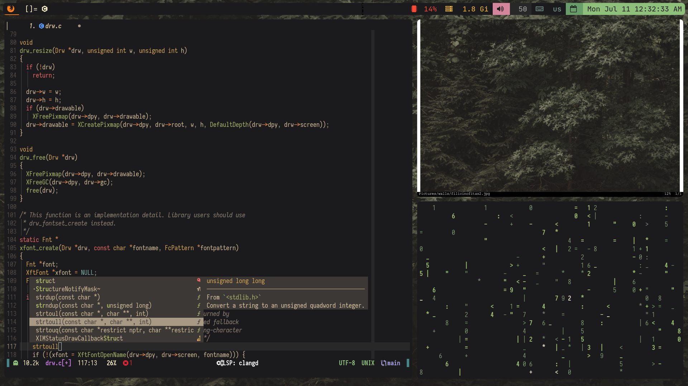
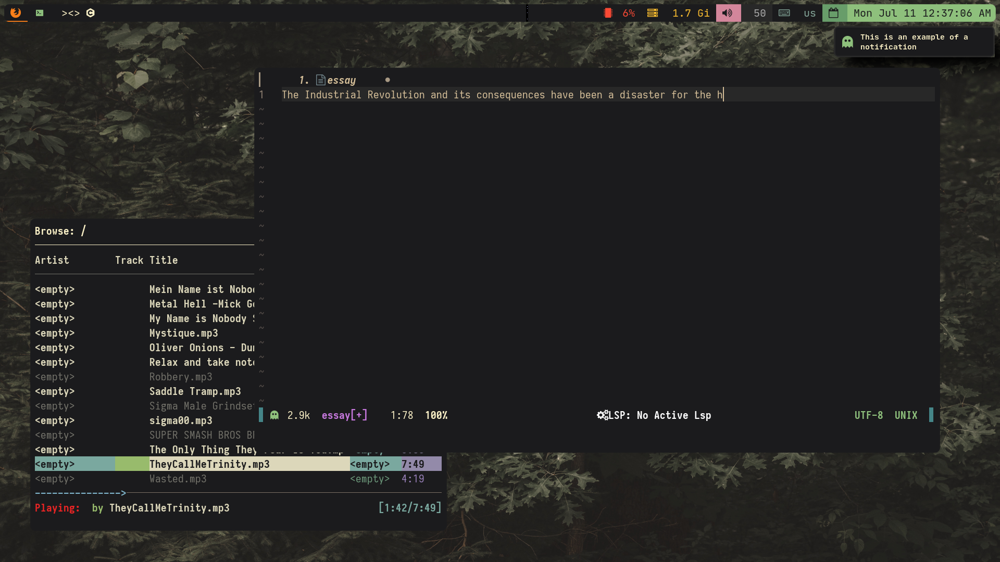
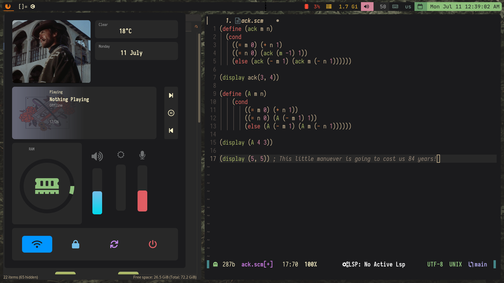
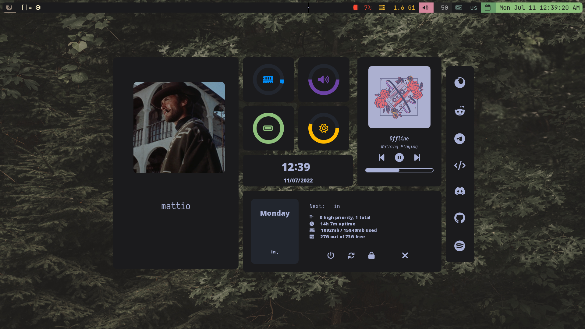

# This is a WIP

### Configs
- Currently has configs of:

- [x] dwm
- [x] st
- [x] slstatus
- [x] dmenu
- [x] slock
- [x] hyprland
- [x] alacritty
- [x] starship
- [x] zsh
- [x] hosts file
- [x] some fetch tools and their configs
- [x] rose browser
- [x] eww
- [x] picom (jonasburg for)
- [x] dunst
- [x] kitty
- [x] some X related stuff (xinitrc and Xressources)
- [ ] nvim, check out [this](https://github.com/Mattio-cmd/SigmaNvim) amazing repo


## Showcase







## Installation

- You can either install everything manually or use the script i provide. I would do it manually because idk about the script, but you can use it if you want.

```
git clone https://github.com/Mattio-cmd/dotfiles
cd dotfiles && chmod +x install.sh; ./install.sh
```


## TO DO
- [ ] Make installer script better
  * I am not that good in shell scripting
